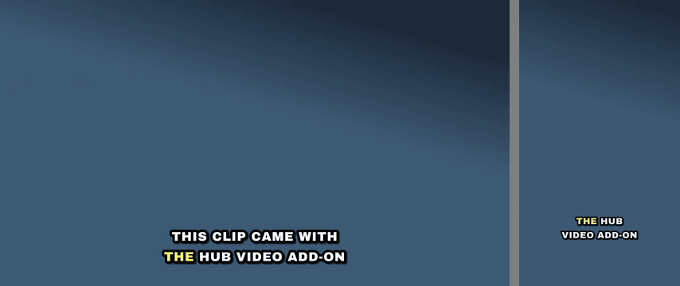

# hub-video

**Let your hub finish your videos.** An add-on for [the hub](https://github.com/MichaelZelbel/teach-it-once-kit) from [*Teach It Once*](https://leanpub.com/teachitonce), Chapter 33.
You record and cut. Then you tell your assistant "caption this and make a vertical version",
or "put a title card in front of it", and it does the finishing on your own computer: captions
in your one look, a 9:16 cut for Reels, TikTok and Shorts, and animated slides and overlays
made with [HyperFrames](https://github.com/heygen-com/hyperframes).



The 8-second sample clip after `hub-video captions` (left) and `hub-video vertical --captions` (right).

This is for some people, not most. If you do not post videos, you do not need this folder.

## What it is

- **Two commands of its own**, `hub-video captions` and `hub-video vertical`. Captions
  are heard by a speech model that runs on your computer, laid out in one fixed look, and
  burned into the picture. The vertical cut takes the middle of a wide picture at full height.
- **HyperFrames, pinned to one release (0.8.43)**: the program installed once on your computer
  and run as `hub-video hyperframes`, and its recipes copied into your hub's skills folder. They
  teach your assistant to build animated title cards, slides, explainers and graphics over a
  talking head, and to render them to MP4. HyperFrames is open source (Apache 2.0) by HeyGen.
  The hub's copy of its recipes differs in one way, said at the top of each: they call
  `hub-video hyperframes` where the originals say `npx hyperframes`. Usage reports are off, and
  the commands that publish, render in the cloud or sign in are refused.
- **One recipe of its own**, `video-finishing`, which tells your assistant which tool fits which
  request, how to check the result before saying it is done, and what it must not do: cut
  your footage, overwrite the source, or post anything.
- **Your caption look**, one file in your hub: `video/caption-style.json`. Every video uses it.

Nothing here is paid. Generated video clips from paid services are not included; see
[setup/4-generated-clips.md](setup/4-generated-clips.md) if you want them anyway.

## What you need

1. A hub from the book on Windows, macOS or Linux, and Node.js 22 or newer.
2. About 1.5 GB of free disk: the speech model (460 MB), its private Python (260 to 420 MB),
   HyperFrames (370 MB) and the browser it draws with (260 MB).
3. ffmpeg, the program that writes video files, and uv, which installs a private Python. On
   Linux also `unzip`. The setup offers to install what is missing and asks first. Details:
   [setup/1-what-you-need.md](setup/1-what-you-need.md).

## Install

In a terminal, from anywhere, one line:

```
npx --yes github:MichaelZelbel/hub-video setup
```

It finds your hub, copies the recipes into its skills folder and saves that in your hub's
history, puts the `hub-video` command next to the kit's other commands, checks ffmpeg and the
speech model and offers to install what is missing, then proves both halves: it captions an
8-second sample clip and renders a 3-second animated title card, and tells you where to watch
them. Run the same line again any time to update; it keeps your caption look and any recipe you
wrote yourself, and deletes nothing.

## Use

Ask your assistant, in your own words:

> Caption ~/Videos/2026-09-20-talk.mp4 and make a vertical version for Reels.

> Make a five-second animated title card that says "Three things I learned this week".

> Put a lower third with my name over the first ten seconds of ~/Videos/intro.mp4.

Or run the two commands yourself:

```
hub-video captions clip.mp4              -> clip.captioned.mp4
hub-video vertical clip.mp4 --captions   -> clip.vertical.captioned.mp4
hub-video hyperframes render             HyperFrames as installed here (check, preview, snapshot...)
hub-video check                          what is installed and what is missing
```

A misheard word: open `clip.words.json`, correct it, run the command again.
Pages: [setup/2-first-captions.md](setup/2-first-captions.md),
[setup/3-animated-slides.md](setup/3-animated-slides.md).

## What is where

- `bin/`: the `hub-video` command (Node, no dependencies).
- `tools/`: `captions.py` the layout, `burn.py` hearing, burning and the vertical cut,
  `caption-style.json` the starting look.
- `skill/video-finishing/`: the recipe the setup copies into your hub.
- `fonts/`: Archivo Black, under the SIL Open Font License (`fonts/OFL.txt`).
- `sample/`: the 8-second clips and the title card the setup's proof uses. The voice is
  synthetic (Kokoro, Apache 2.0).
- `setup/`: four pages. `test/`: network-free tests, `npm test`.

## Where it came from

This is the video finishing the author's own hub does for his posts, with his fonts, his
project files and his paid clip service taken out. Two of his videos went through all of it in
September 2026. The whole story, including what the hub does not do, is in *Teach It Once*,
Chapter 33.

MIT. Use it, change it, share it.
